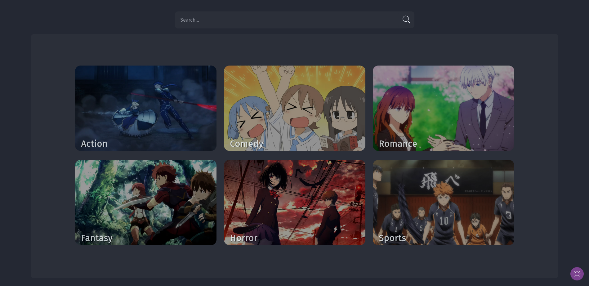
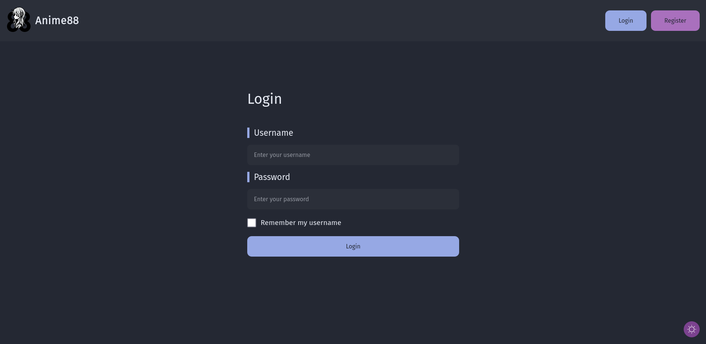
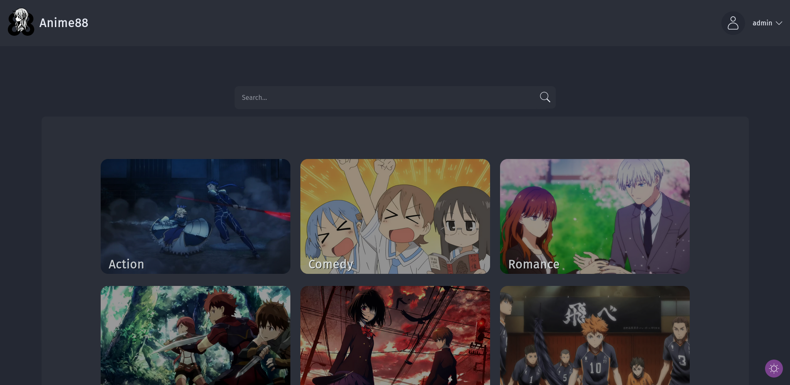
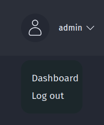

# Anime88 | Manual Book

Anime88 merupkan website dimana para pengguna dapat memberi nilai dan ulasan terhadap Anime-anime favorit mereka.
Website ini memiliki 2 Role, Admin dan User.

## Landing Page

Saat Memasuki Website Anime88, Pengguna akan memasuki Landing Page dari website

Di landing page, Pengguna yang belum melakukan Login/register akan memiliki status "Guest".
Login/Register dapat dilakukan dengan meng-click tombol Login/Register di Navbar, pojok kanan atas.
Pengguna dapat Login sebagai Admin atau user dan hanya dapat Register sebagai User.

## Admin

Admin didalam website ini memiliki role sebagai orang yang memanage data anime, Admin dapat Menambahkan, Membaca, Mengubah dan Menghapus data anime.

### Login Sebagai Admin

Admin dapat melakukan Login dengan menginputkan Username "admin" dengan Password "admin".
Didalam Website kami hanya memiliki satu admin, Jika ingin menambahkan admin baru, tidak bisa melalui websitenya secara langsung,
bila ingin menambahkan admin baru harus menghubungi operator website untuk menambahkan admin baru.

Setelah memasukkan Username dan Password admin yang benar, Click Login lalu anda akan termasuk Akun admin

### Admin Landing Page

Admin akan memiliki landing page seperti berikut

Klik pada username/icon `⌄` disamping nama admin, maka akan tampil dua pilihan yang dapat dipilih admin

    

### -Admin Log out

Salah satu menu yang dapat dipilih oleh Admin yaitu Log out, Dimana admin dapat melakukan log out dari akun admin menjadi "Guest", Akan diarahkan kembali ke menu login

### -Admin Dashboard Menu

Menu lainnya yang dapat admin click yaitu "Dashboard" dimana setelah meng-click "Dashboard" Admin Akan Ditujukan ke halaman dashboard admin.

Dalam Menu Dashboard, ditampilkan beberapa data yaitu, "Total Users" yang menunjukkan jumlah user yang telah terdaftar didalam website ini,
"Total Anime" yang menunjukkan Jumlah Anime/Data Anime yang ada didalam website ini, "Total Reviews" dimana menunjukkan total reviews yang telah dilakukan oleh seluruh users yang telah terdaftar,
dan terakhir ada "Random Anime" dimana data anime (title) yang ada akan di pilih secara random dan akan ditampilkan disini

Di bagian kiri Dashboard terdapat Sidebar menu yang menampilkan Page Dashboard apa yang sedang di akses dan yang dapat di akses oleh admin,
Terdapat Menu "Dasboard" (Halaman Sekarang), Menu Create, Menu "Read" dan Menu "Home".

Masing-masing menu dapat di click dan akan menuju ke halaman mereka.

### -Admin Create Menu

Didalam menu "Create", Admin dapat melakukan penambahan data anime dengan memasukkan data-data kedalam form Create Anime.

Admin Dapat Menambahkan Nama Anime, Sinopsis anime, Jumlah Episode, Genre Anime (Admin dapat memilih genre dengan menekan genre yang ingin dimasukkan),
Status anime, Season anime, Tahun Anime, Studio anime dan Poster anime.

### -Admin Read Menu

Menu "Read" merupakan menu dimana Admin dapat melihat seluruh Anime yang telah di tambahkan.

Didalam menu "Read" ini admin juga dapat melakukan Searching terhadap anime yang ada di dalam search bar yang tersedia,
Admin juga dapat mem-filter berdasarkan Season dan Tahun rilis anime tersebut.

Dengan Memilih Season atau Memasukkan Tahun kedalam Kolom "Tahun".

### -Admin Read Detail Anime

Admin dapat meng-click Poster Anime dan akan menunjukkan mereka ke halaman detail anime tersebut.

Disini Admin dapat melihat seluruh data anime yang telah di "Create" serta informasi lainnya seperti,
"Score", "Ranking", Jumlah User yang me-rank dan me-review anime tersebut.

### -Admin Update Menu

Untuk Melakukan Update terhadap data anime, Admin dapat meng-click tombol "Update" yang ada di halaman Detail anime,
Tombol Berada di bagian "Actions" yang terletak di bagian kiri halaman.

Setelah meng-click tombol "Update" maka akan di arahkan ke halaman Update anime yang dimana admin dapat merubah data anime tersebut,
Akan ditampilkan data anime sebelum di update.
Setelah Selesai Mengupdate, Admin dapat meng-click tombol "Update" untuk mengupdate data anime tersebut.

### -Anime Delete Button

Untuk menghapus data anime, Admin dapat Meng-click tombol "Delete" yang berada di sebelah tombol "Update".

Akan ada Konfirmasi setelah meng-click tombol "Delete", Admin dapat menekan "Cancel" jika ingin membatalkan penghapusan dan "Ok" Jika ingin lanjut menghapus data

Jika Admin memilih "Ok" maka data anime akan terhapus dan akan muncul alert seperti berikut.

### -Home Button

Terdapat Menu "Home" pada sidebar dashboard yang bila di click akan mengembalikan admin ke halaman utama website

## User

User atau Pengguna pada website ini memiliki role sebagai User yang dapat Melihat Anime beserta detailnya, Memberi Rating dan Review terhadap anime yang ingin mereka rate/review.

### -Login User

User dapat melakukan login jika sudah memiliki akun, Setelah memasukkan Username dan Password, click submit untuk melakukan Login.

Setelah itu maka user akan masuk sebagai user yang terdaftar dan dapat dilihat di pojok kanan atas/navbar

### -Registrasi User

Jika pengguna belum mendaftarkan akun di wabsite Anime88, Pengguna dapat melakukan Registrasi Akun dengan meng-click tombol "Registrasi" di sebelah tombol "login".

Setelah meng-click tombol "Registrasi", akan tampil form Registrasi untuk pengguna mendaftarkan akun mereka.
Masukkan Username, Password dan confirm Passowrd nya lalu click "Register"

Setelah Register maka akan di arahkan ke form login untuk melakukan login dengan akun yang baru didaftarkan.

Setelah login maka akun telah terbuat dan pengguna akan login sebagai akun yang telah didaftarkan.

### -User Landing Page

User akan memiliki landing page sebagai berikut.

Click menu dropdown  disamping nama user, maka akan tampil dua pilihan yang dapat dipilih user

Selain itu, Di landing page terdapat Konten yang lain seperti,

Search bar, dimana user dapat melakukan Searching, searching juga dapat di filter berdasarkan season dan tahun rilis.

View beberapa genre yang ada di anime.

Section Quotes yang akan menampilkan quotes-quotes secara random setiap page di refresh

Section "Top Anime" menampilkan 4 Top anime (anime yang paling tinggi ratingnya), dan tombol "View All" menuju page Anime yang di sort ratingnya secara descending.

Section "Seaosonal Anime" menampilkan 4 Seasonal anime (anime yang sedang tayang/airing), dan tombol "View All" menuju page Anime yang akan menampilkan seluruh anime yang sedang airing.

Terdapat tombol dark-mode/light-mode yang dapat di akses di page manapun di ujung kanan bawah page.

### -User Log out

Sama seperti Admin, Salah satu menu yang dapat dipilih oleh User yaitu Log out, Dimana user dapat melakukan log out dari akun User menjadi "Guest", Akan diarahkan kembali ke menu login.

### -User Melihat Detail Anime

User dapat melihat detail anime dengan cara meng-click poster anime atau title animenya

Maka akan tampil detail anime tersebut.

### -User Rating & Review Anime

User dapat melakukan rating terhadap anime dengan cara memasuki halaman detail anime yang inging di rating,
Lalu meng-click tombol "Add Review"

Setelah itu akan tampil form untuk melakukan rating & dan review seperti berikut.

Setelah selesai, click submit untuk mengsubmit review & rating.
User juga dapat mengosongkan review bila tidak ingin memberikan ulasan terhadap anime,
Namun user tidak bisa mengosongkan bagian "Rating" dan hanya mengisi review.

### -User Profile

Menu lain yang ada di Menu dropdown selain Log out yaitu Profile.
User dapat melihat profile mereka dengan meng-click tombol "Profile"

Halaman Profile akan berisi beberapa informasi tentang user seperti
Username, Total Anime Rated dan Rata-rata/mean score anime.
Dan juga anime yang telah di Rate & Review oleh user tersebut.

## Guest Mode

Guest Mode adalah state dimana Pengguna Admin maupun User belum melakukan Login.

Untuk Tampilan dalam mode guest sama seperti user biasa, namun dilimitasi dengan hanya bisa melihat landing page,
melakukan searching, dan melihat detail anime.

pengguna dengan Guest Mode tidak dapat melakukan review & rating dan tidak memiliki profile
